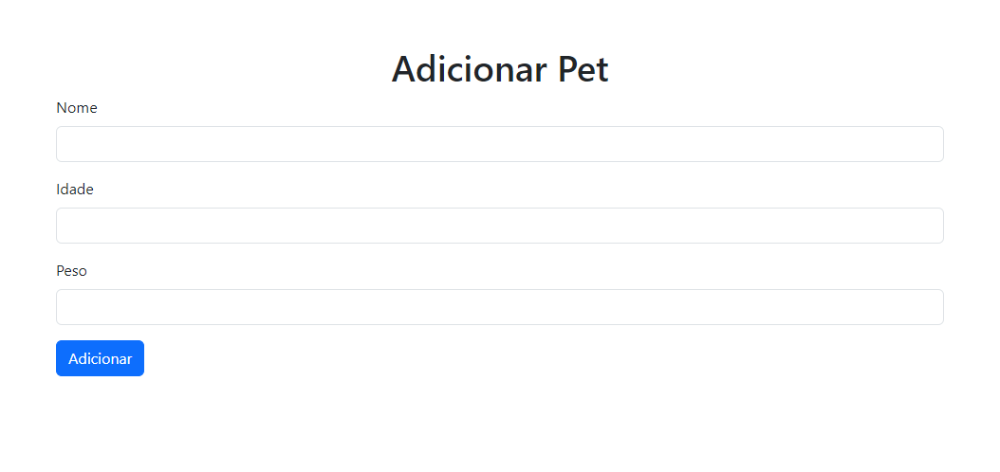

# Projeto Final Ada - Flask Web Application

## Sumário

Este projeto é uma aplicação web desenvolvida em Flask que permite o cadastro e visualização de informações sobre pets. A aplicação utiliza SQLite como banco de dados e é servida usando Gunicorn, proporcionando uma interface amigável para o usuário.

## Demonstração Visual

Veja abaixo algumas capturas de tela da aplicação em funcionamento:




Ou assista a um GIF da aplicação em ação:


## Funcionalidades

- Adicionar novos pets com nome, idade e peso.
- Visualizar a lista de pets cadastrados com fotos de placeholder.
- Validação de entrada com mensagens de erro amigáveis.

## Tecnologias Utilizadas

- **Python**: Linguagem de programação principal.
- **Flask**: Framework web leve e flexível.
- **SQLite**: Banco de dados simples e eficiente para armazenar os dados dos pets.
- **Gunicorn**: Servidor WSGI para executar aplicações Flask em produção.
- **Bootstrap**: Framework CSS para estilização e layout responsivo.

## Como Usar

### Requisitos

- Python 3.8 ou superior
- pip (gerenciador de pacotes do Python)

### Instalação

1. Clone o repositório:

    ```bash
    git clone https://github.com/PedroPrebeck/projeto-final-ada.git
    cd projeto-final-ada
    ```

2. Crie um ambiente virtual e ative-o:

    ```bash
    python -m venv myenv
    source myenv/bin/activate
    ```

3. Instale as dependências:

    ```bash
    pip install -r requirements.txt
    ```

### Executando Localmente

1. Execute a aplicação:

    ```bash
    gunicorn --bind 0.0.0.0:5000 app:app
    ```

2. Acesse a aplicação no navegador em `http://localhost:5000`.

### Deploy para Produção

O projeto usa GitHub Actions para deploy automático no EC2. Consulte o arquivo `deploy.yml` para detalhes de configuração.

## Demonstração

Confira a demo da aplicação em funcionamento: [Acesse a Demo](http://ec2-3-83-50-112.compute-1.amazonaws.com:5000/)

## Contribuindo

Veja as diretrizes de contribuição no arquivo [CONTRIBUTING.md](docs/CONTRIBUTING.md).

## Pessoas que já contribuíram

<a href="https://github.com/PedroPrebeck/projeto-final-ada/graphs/contributors"></a>

## Autores

| [<br><sub>@PedroPrebeck</sub>](https://github.com/PedroPrebeck) |
| :---: |

---

Este projeto é apenas para fins educacionais e demonstração. Sinta-se à vontade para usá-lo como base para aprendizado e experimentação.